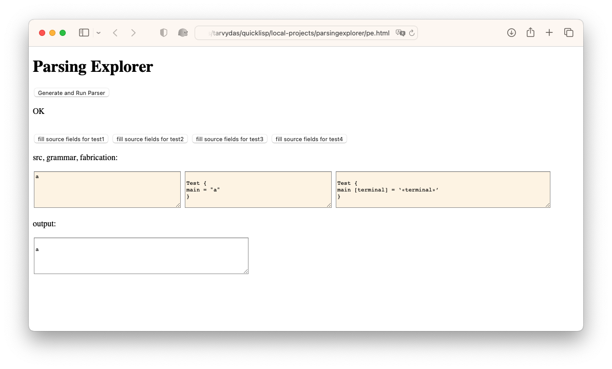

# Parsing Explorer
A REPL for developing tiny languages, DSLs and SCNs.

# Usage

Load `pe.html` into a browser and enable UTF-8 fonts.

Press one of the `fill` buttons to create canned tests or enter your own text in the `src`, `grammar` and `fabrication` fields.

Press the `Generate and Run Parser` button.

Observe generated text in `output` window.

## Canned Tests
The demonstration consists of 4 small tests:

1. parse a single letter
2. parse a letter surrounded by whitespace (newlines)
3. Repetition operators */+/?, with ---
4. A very, very simple fast food front counter order parser that transpiles orders into JavaScript code sequences and outputs JavaScript `kitchen.ticket(...);` commands.

A test run is executed by pressing the button labelled "Generate and Run Parser".

The parsing explorer can be used to run one of the 4 canned tests, or, can run a manually edited test.

# More Detail
see doc/documentation.md
# Warts
- This version uses an older library called `fmt-js`
	- This version should be modified to use the new `transpile` library.