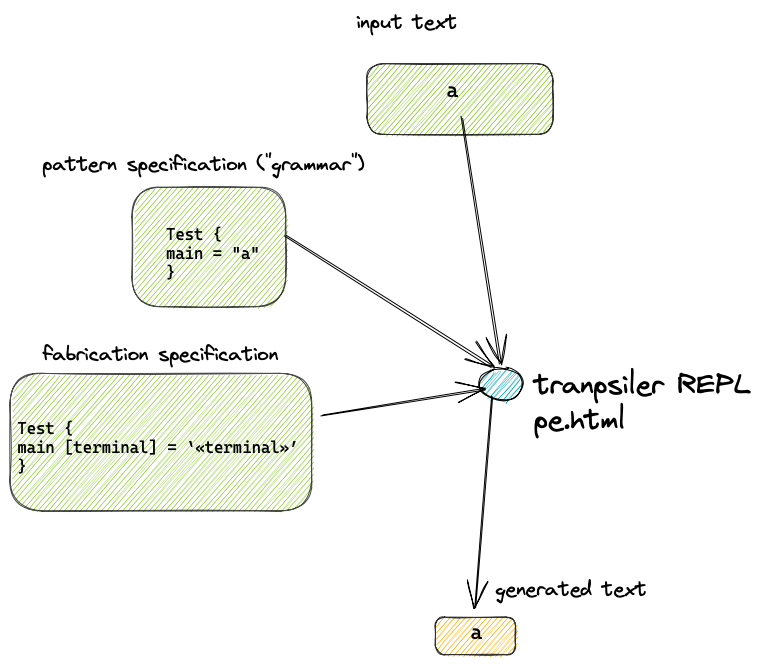

# Parsing Explorer
A REPL for developing tiny languages, DSLs and SCNs.



# Usage
![[doc/pescreenshot.png]]
Load `pe.html` into a browser and enable UTF-8 fonts.

Press one of the `fill` buttons to create canned tests or enter your own text in the `src`, `grammar` and `fabrication` fields.

Press the `Generate and Run Parser` button.

Observe generated text in `output` window.

## Canned Tests
The demonstration consists of 4 small tests:

1. parse a single letter
2. parse a letter surrounded by whitespace (newlines)
3. Repetition operators */+/?, with ---
4. A very, very simple fast food front counter order parser that transpiles orders into JavaScript code sequences and outputs JavaScript `kitchen.ticket(...);` commands.

A test run is executed by pressing the button labelled "Generate and Run Parser".

The parsing explorer can be used to run one of the 4 canned tests, or, can run a manually edited test.

---

Each canned test consists of 3 input areas and one output area.

Each input is represented by:
1. source code to be parsed
2. an Ohm-JS pattern-matching specification (called a "grammar")
3. a code fabricator specification that is fired into action when parsing is successful.

For example, for the first test...
## source code 
`a`
## grammar 
```
Test {
main = "a"
}
```
## fabrication spec
```
Test {
main [terminal] = ‛«terminal»’
}
```
The fabrication spec is converted to JavaScript functions that match 1:1 with the patterns.

Each matched sub-pattern is passed to the converted JavaScript function as a function parameter with an arbitrary name. 

In this case, there is only one function parameter with the name `terminal`.

The fabrication spec contains 2 types of things enclosed in quotes `‛ ... ’`:
1. raw characters 
2. evaluations of function parameters, in this case `«terminal»`.

Each quoted RHS in the spec is converted into a JavaScript template string, with evaluations converted to `${ ... }` template string operations.  In this case, the final JavaScript template string is `\`${template}\``. 

Each fabrication function returns a single string, possibly containing strings generated by lower-level fabrication functions.
## output
The first example simply outputs the input character `a`.

The input areas can be filled in by pressing one of the "fill source ..." buttons, or, by typing characters directly into the areas.


